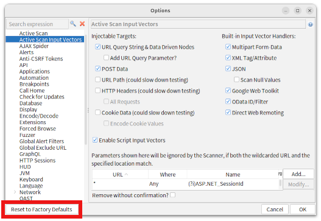

## CustomActiveScanForZAP

 

A ZAP AddOn ActiveScan for detecting SQL injections.
Real Web application page has dynamic contents such as special sale products list or CSRF token, which is not affected by input parameters.
The web application vulnerability scanner manipulates input parameters to detect vulnerabilities by affecting page content. 
The scanner may fail to detect vulnerabilities if the dynamic content of the web page has contents which is unaffected by the input parameters. 
Therefore, this CustomActiveScan uses LCS (Longest Common Sequece) algorithm to remove these unnecessarily dynamic content.
Due to this method, this scanner has a superior vulnerability detection capability.

### how to remove these dynamic contents which is not affected input parameters.

LCS(Longest Common Sequence) algorighm extracts the content that is common to two array elements.
For example, you have a web page that contains a CSRF token. The CSRF token has a unique value for each http request.
To erase this token, this addon sends two identical http requests and computes the response LCS of the two requests.
LCS remove the different token values ​​from the two responses as follows:
 

    [response1]
    <form action="add.php" method="POST">
    <input type="hidden" name="token" value="dbc8ee88f64bf794505ef74e41d6e5a4">
    <input type="submit"  value="Complete">
    </form>
    
    [response2]
    <form action="add.php" method="POST">
    <input type="hidden" name="token" value="bcb138585064356efa927ab196cbf8ec">
    <input type="submit"  value="Complete">
    </form>
    
    [LCS]
    <form action="add.php" method="POST">
    <input type="hidden" name="token" value=">
    <input type="submit"  value="Complete">
    </form>
    

* Before calculating the LCS, this addon splits the response content by whitespace/JSON/HTML delimiters or characters and stores it in an array.

##  SQL injection test some results.
<TABLE>
 <TR><TH ROWSPAN="2">SQL injection Detection rate (Detected/Total)</TH><TH>CustomActiveScan ForZAP  0.8.3</TH><TH>Active Scanner Rules(alpha) 44.0.0</TH><TH>Active Scanner Rules 57.0.0</TH><TH>Advanced SQLInjection Scanner 15.0.0</TH></TR>
 <TR><TH>100% (14/14)</TH><TH>50% (2/4)</TH><TH>20% (2/10)</TH><TH>40% (4/10)</TH></TR>
</TABLE>
  
[See Details](https://github.com/gdgd009xcd/CustomActiveScanForZAP/wiki/99.1.-SQL-injection-detection-test-results-with-ActiveScan)

## Prerequisite

* ZAPROXY ver 2.13.0 or later
* java ver 11 or later

## Download & Building

### build with command line tools(Ubuntu)

The add-on is built with [Gradle]: https://gradle.org/  

To download & build this addon, simply run:  

    $ git clone https://github.com/gdgd009xcd/CustomActiveScanForZAP.git  
    $ cd CustomActiveScanForZAP  
    $ ./gradlew addOns:customactivescan:jarZapAddOn  

The add-on will be placed in the directory `CustomActiveScanForZAP/addOns/customactivescan/build/zapAddOn/bin`

    $ cd addOns/customactivescan/build/zapAddOn/bin  
    $ ls  
      customactivescan-alpha-0.0.2.zap  
    $  

* Gradle builds may fail due to network connection timeouts for downloading dependencies. If you have such problems, please retry the gradlew command each time. or you can download addon file from [release page](https://github.com/gdgd009xcd/CustomActiveScanForZAP/releases)

### build with IntelliJ IDEA(Hereafter referred to as IJ)

1. start IJ, click [Clone Repository]
1. specify URL of this repository. for example: https://github.com/gdgd009xcd/CustomActiveScanForZAP.git
1. click [Clone]. IJ's IDE is opened.
1. In the IJ's IDE, To display the Gradle tool window, select menu:[View->Tool Windows->Gradle] or click [gradle] icon. It shows a tree of Gradle tasks.
1. double click gradle task named: [zap-extensions->Tasks->build->jarZapAddon]
1. The addon zap file will be placed in the directory: `CustomActiveScanForZAP/addOns/customactivescan/build/zapAddOn/bin`

## Install

This addon is 3rd party addon, so you must add this addon file to ZAPROXY manually. this addon does not have any telemetry feature.

1. download add on file customactivescan-xxx-n.n.n.zap on [this release page](https://github.com/gdgd009xcd/CustomActiveScanForZAP/releases)
1. Start ZAPROXY in your PC's Desktop.  
1. Install add-on customactivescan-xxx-n.n.n.zap file according to the ZAP add-on installation method (example: File menu "Load add-on file"). 
     
1. restart zap(sorry, currently this addon does not work unless restart zap after install it.)

## how to use

1. Active Scan Input Vectors option panel 
When you start active scannig, This addon is automatically called next to the already installed default scanners.
If this addon look like doing nothing, you should check:  [Tools->Options->Active Scan Input Vectors] option panel. 
If nothing is enabled in this options panel, you may push [Reset to factory defaults] button or check on individually.

2. Why does this scan hang at 37% on the scan progress gauge? 
This is not this addon's problem. 
Zaproxy's DOM XSS Active scanner rule(DomXssScanRule) plugin uses selenium to scan. 
In ubuntu latest version, selenium may not work with the Firefox Snap Version(default). 
Workarounds have many ways, so I can't explain all of them. but I can explain some of them. 
You may change browser id in  [tools-options->rule configuration->rules.domxss.browserid] to avoid this problem. 
Because this problem occurs with using the Firefox Snap Version. 
Available values are "firefox", "firefox-headless"(default), "chrome", "chrome-headless". 
I choosed "chrome-headless". but despite changed this value, you may need proper chrome browser and WebDriver for using DomXssScanRule. so this solution is to avoid hangup only and DomXssScanRule will still skipped in scanning. 

3. CustomScan.policy file 
   If you have any doubts whether this scanner is actually being called, you can import the [CustomScan.policy](CustomScan.policy) file. This policy forces only the use of CustomScanRules when invoking active scan. using guide is follows: 

   1. download [CustomScan.policy](CustomScan.policy)
   1. select menu [Analyse->Scan Policy Manager->import], and load CustomScan.policy file.
   1. when you start scan, select policy [Custom Scan].

Information on how to use can be found at the following link:  
[Basic Usage](https://github.com/gdgd009xcd/CustomActiveScanForZAP/wiki/1.0.-Basic-Usage)

## Author
### [gdgd009xcd](https://gdgd009xcd.github.io/)
